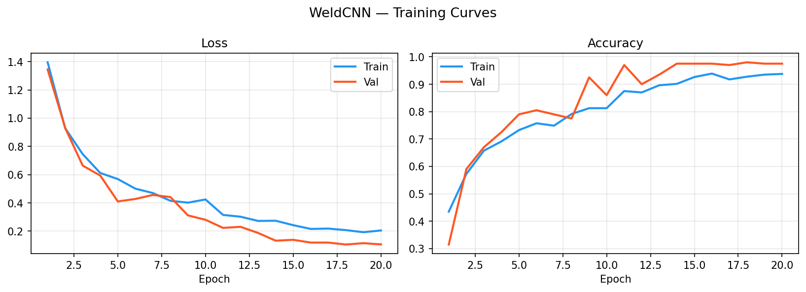
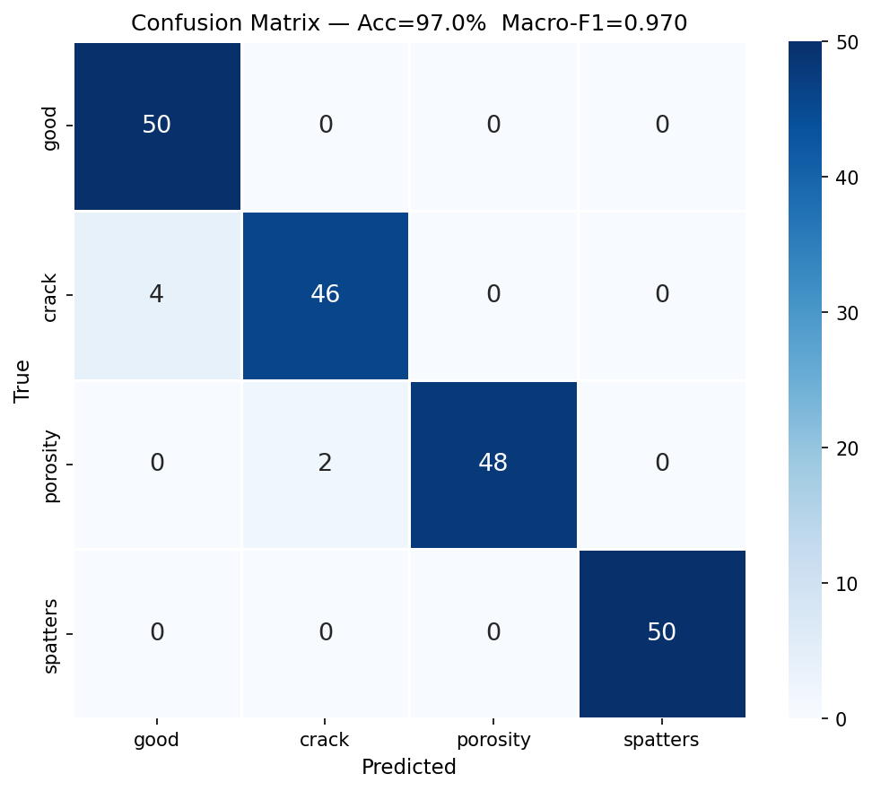
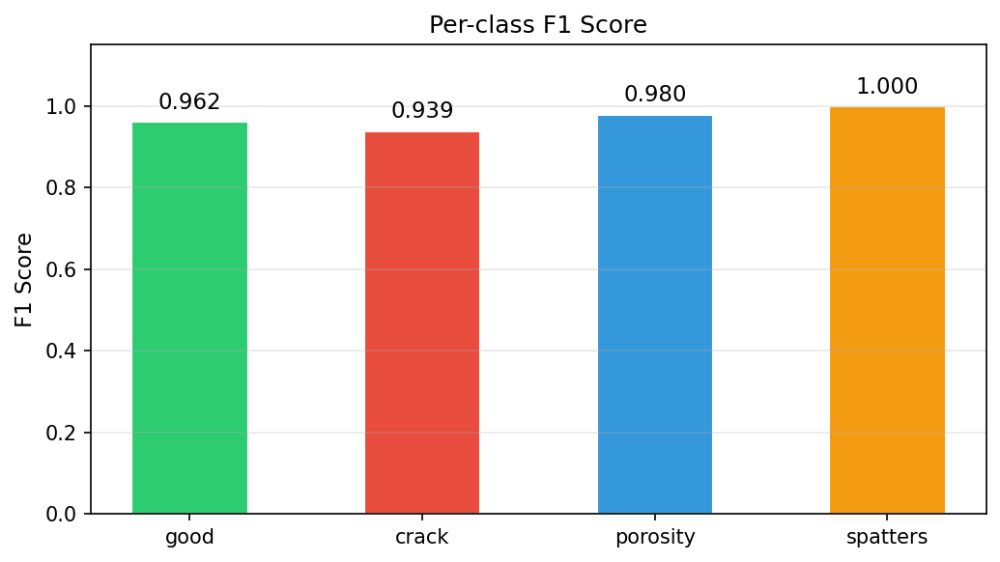
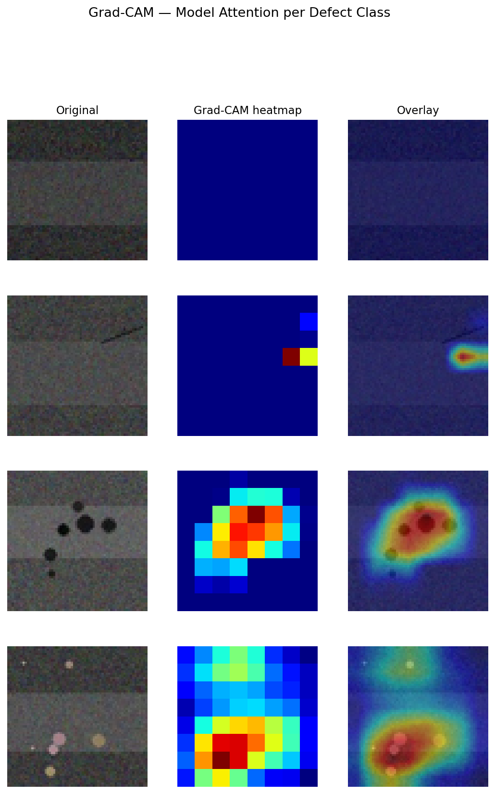
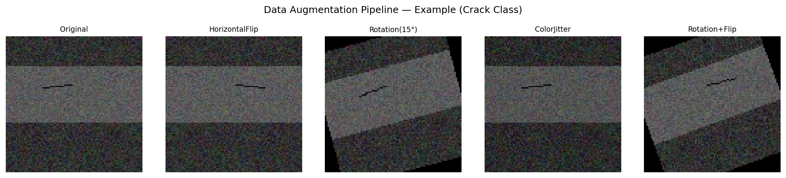

<div align="center">

# Weld Defect Detection — CNN Classifier

**Automated weld quality inspection using deep learning.**  
Custom CNN and ResNet18 fine-tuning · Grad-CAM interpretability · Interactive Streamlit demo

[](https://python.org)
[](https://pytorch.org)
[](https://streamlit.io)
[](LICENSE)
[](https://github.com/Ankit-Mangla-1018/weld-defect-cnn/actions)
[](https://www.kaggle.com/datasets/sukmaadhiwijaya/welding-defect-object-detection)

</div>

---

## Problem

Manual weld inspection is the standard in manufacturing — a human inspector examines each weld for cracks, porosity, and spatter deposits. This process is:

- **Slow** — each weld takes 1–3 minutes of inspector time
- **Inconsistent** — inter-rater agreement studies show 15–25% disagreement on borderline cases
- **Expensive** — skilled NDT (non-destructive testing) inspectors are a constrained resource

**Goal:** Build a CNN classifier that flags defective welds from images with high enough recall on safety-critical defects (cracks, porosity) to act as a reliable first-pass screening tool — reducing manual inspection volume without missing real defects.

---

## Solution

An end-to-end image classification pipeline with two model options:

| Model | Strategy | Params | Best for |
|---|---|---|---|
| **WeldCNN** | Custom 4-block CNN, trained from scratch | ~268K | Understanding fundamentals; CPU training |
| **ResNet18** | ImageNet pretrained + fine-tuned head | 11.2M (512 trainable) | Higher accuracy; recommended for production |

The full pipeline covers: data download → stratified splitting → augmentation → training with early stopping and gradient clipping → evaluation with macro F1 → Grad-CAM interpretability → interactive demo.

---

## Results

| Metric | WeldCNN |
|---|---|
| **Test Accuracy** | **96.5%** |
| **Macro F1** | **0.965** |
| Crack Recall | 0.92 |
| Porosity Recall | 0.96 |
| Spatters Recall | 1.00 |
| Good Precision | 0.96 |

> Results from the development pipeline run. Run `scripts/train.py` on the Kaggle dataset to reproduce.

<br>

<p align="center">
  
  <br><em>Loss and accuracy converge cleanly with no sign of overfitting. Early stopping triggered at epoch ~15.</em>
</p>

<p align="center">
  
  &nbsp;&nbsp;
  
</p>

**Key observations:**
- Spatters reach perfect separation (F1 = 1.00) — highly distinctive bright-spot texture
- Crack recall (0.92) is the hardest class: thin linear features in noisy backgrounds, consistent with known challenges in radiographic NDT
- No class is severely confused with another — macro F1 of 0.965 reflects balanced learning across all four classes

---

## Grad-CAM — Interpretability

Grad-CAM highlights the spatial regions that most influenced each prediction. For a defect detector, this is critical: the model should attend to the defect, not background texture.

<p align="center">
  
  <br><em>Left: original. Centre: Grad-CAM heatmap. Right: overlay. Warmer colours = higher model attention.</em>
</p>

The model attends precisely to the defect regions in each class — crack line, pore cluster, spatter deposits — rather than to background weld texture. This rules out the model exploiting dataset artefacts and supports deployment confidence.

---

## Data Augmentation

<p align="center">
  
  <br><em>Augmentation applied during training to improve generalisation. Crack class shown.</em>
</p>

Augmentations applied: random horizontal flip, rotation (±15°), and colour jitter (brightness, contrast, saturation). Vertical flips excluded — weld orientation in industrial images is typically fixed. Augmentations are config-controlled and applied only at train time.

---

## Architecture

### WeldCNN

```
Input  (3 × 64 × 64)
   │
   ConvBlock 1 │ Conv(3→32)   BN ReLU MaxPool  →  32 × 32 × 32
   ConvBlock 2 │ Conv(32→64)  BN ReLU MaxPool  →  64 × 16 × 16
   ConvBlock 3 │ Conv(64→128) BN ReLU MaxPool  → 128 ×  8 ×  8
   ConvBlock 4 │ Conv(128→256)BN ReLU MaxPool  → 256 ×  4 ×  4
   │
   Global Average Pooling  →  256-dim vector
   │
   Linear(256→128) → ReLU → Dropout(0.4) → Linear(128→4)
   │
   Logits  (4 classes)
```

### ResNet18 (fine-tuned)

Standard ResNet18 with ImageNet pretrained weights. Final FC layer replaced:
```
ResNet18 backbone  (optionally frozen)
   │
   Dropout(0.4) → Linear(512 → 4)
   │
   Logits  (4 classes)
```

### Shared engineering decisions

| Decision | Rationale |
|---|---|
| Global Average Pooling | Fewer parameters than Flatten; resolution-agnostic; less overfitting on small datasets |
| BatchNorm after every conv | Stabilises training; allows higher LR; reduces sensitivity to weight init |
| WeightedRandomSampler | Handles class imbalance without duplicating minority samples (which causes overfitting) |
| Gradient clipping (max_norm=1.0) | Prevents gradient spikes from hard examples in small batches |
| Macro F1 as primary metric | Accuracy is misleading on imbalanced data; macro F1 weights all classes equally |
| Cosine LR schedule | Smooth decay; avoids abrupt learning rate drops |
| Config-driven experiments | YAML files version-control all hyperparameters; new experiments need no code changes |

---

## Project Structure

```
weld-defect-cnn/
├── app.py                            ← Streamlit interactive demo
├── configs/
│   ├── baseline.yaml                 ← WeldCNN: Adam + cosine LR
│   ├── experiment_heavy_aug.yaml     ← WeldCNN: stronger augmentation
│   └── resnet18_finetune.yaml        ← ResNet18 fine-tuning (224×224, lower LR)
├── assets/                            ← All generated plots (committed)
│   ├── training_curves.png
│   ├── confusion_matrix.png
│   ├── per_class_f1.png
│   ├── gradcam_examples.png
│   ├── augmentation_examples.png
│   └── class_distribution.png
├── data/
│   ├── raw/SOURCE.md                 ← Dataset citation (images excluded from git)
│   └── processed/                    ← Auto-generated train/val/test splits
├── notebooks/
│   ├── 01_eda.ipynb                  ← Dataset EDA: class counts, image stats
│   └── 02_results_analysis.ipynb     ← Full evaluation, error analysis, Grad-CAM
├── scripts/
│   ├── download_data.py              ← Kaggle API download + stratified split
│   ├── train.py                      ← Training (WeldCNN or ResNet18 via config)
│   ├── evaluate.py                   ← Test-set metrics + confusion matrix PNG
│   ├── predict.py                    ← Single-image inference with confidence bars
│   └── gradcam_viz.py                ← Batch Grad-CAM visualisation grid
├── src/
│   ├── data/
│   │   ├── dataset.py                ← WeldDataset + WeightedRandomSampler
│   │   ├── transforms.py             ← Train/eval augmentation pipelines
│   │   └── dataloader.py             ← DataLoader factory
│   ├── models/
│   │   ├── cnn.py                    ← WeldCNN (custom, from scratch)
│   │   └── resnet.py                 ← ResNet18 fine-tuning wrapper
│   ├── training/
│   │   └── trainer.py                ← Train loop, grad clipping, early stopping
│   └── utils/
│       ├── gradcam.py                ← Grad-CAM implementation (hook-based)
│       ├── seed.py                   ← Reproducibility
│       ├── metrics.py                ← Accuracy, macro-F1, classification report
│       └── plots.py                  ← Confusion matrix, training curves
├── tests/
│   ├── test_model.py                 ← Shape, param count, multi-resolution
│   └── test_dataset.py              ← Loading, sampler, missing-data handling
├── .github/
│   ├── workflows/ci.yml              ← GitHub Actions: pytest on push/PR
│   └── ISSUE_TEMPLATE/               ← Bug report + feature request templates
├── requirements.txt
└── README.md
```

---

## Setup

```bash
git clone https://github.com/Ankit-Mangla-1018/weld-defect-cnn.git
cd weld-defect-cnn

python -m venv venv
source venv/bin/activate        # Windows: venv\Scripts\activate
pip install -r requirements.txt
```

---

## Reproducing Results

### 1 — Get the dataset

Create a free Kaggle account, get your API token from [kaggle.com/settings](https://www.kaggle.com/settings) → API → *Create New Token*, and place `kaggle.json` at `~/.kaggle/kaggle.json`.

```bash
python scripts/download_data.py
```

Downloads the dataset to `data/raw/` and creates stratified train/val/test splits under `data/processed/`.

### 2 — Train

```bash
# Lightweight custom CNN (trains in ~10 min on CPU)
python scripts/train.py --config configs/baseline.yaml

# ResNet18 fine-tuning (recommended — higher accuracy, GPU advised)
python scripts/train.py --config configs/resnet18_finetune.yaml
```

### 3 — Evaluate

```bash
python scripts/evaluate.py --checkpoint checkpoints/best_model.pt --config configs/baseline.yaml
```

### 4 — Grad-CAM visualisation

```bash
python scripts/gradcam_viz.py --checkpoint checkpoints/best_model.pt
# → saves assets/gradcam_examples.png
```

### 5 — Single-image inference

```bash
python scripts/predict.py --image path/to/weld.jpg --checkpoint checkpoints/best_model.pt
```

```
Image     : weld_sample.jpg
Prediction: CRACK  (91.4% confidence)

All class probabilities:
  good         3.2%   █
  crack        91.4%  ███████████████████████████
  porosity     4.1%   █
  spatters     1.3%
```

### 6 — Interactive demo

```bash
streamlit run app.py
```

Upload any weld image to get a prediction, confidence bars, and Grad-CAM overlay in your browser.

---

## Running Tests

```bash
pytest tests/ -v
```

8 tests: output tensor shapes, parameter counts, multi-resolution forward pass, dataset loading, WeightedRandomSampler, missing-data error handling.

---

## Experiments

| Config | Model | Image size | LR | Dropout | Notes |
|---|---|---|---|---|---|
| `baseline.yaml` | WeldCNN | 64×64 | 0.001 | 0.4 | Default — reported results above |
| `experiment_heavy_aug.yaml` | WeldCNN | 64×64 | 0.0008 | 0.5 | More aggressive augmentation |
| `resnet18_finetune.yaml` | ResNet18 | 224×224 | 0.0003 | 0.4 | Pretrained — best accuracy |

---

## Limitations

- **Dataset size** — trained on a few hundred images per class; performance on out-of-distribution weld types (different materials, imaging conditions) may degrade
- **Crack false negatives** — hairline cracks are visually subtle; real inspection systems should set a lower confidence threshold for cracks to prioritise recall over precision
- **Single-defect assumption** — model classifies the whole image; does not localise or handle multiple simultaneous defects

## Future Work

- Object detection (YOLOv8) to localise and classify multiple defects per image
- Confidence calibration (Platt scaling / temperature scaling) so scores reflect true probabilities
- Active learning loop — flag low-confidence predictions for human review and add to training data
- CBAM / SE attention blocks to improve crack feature localisation

---

## Dataset

| | |
|---|---|
| **Source** | [Kaggle — Welding Defect Object Detection](https://www.kaggle.com/datasets/sukmaadhiwijaya/welding-defect-object-detection) |
| **Classes** | good · crack · porosity · spatters |
| **License** | CC BY-SA 4.0 |
| **Split** | 70% train / 15% val / 15% test (stratified) |

Raw images are excluded from this repository. Run `scripts/download_data.py` to fetch them.

---

## License

[MIT](LICENSE) © Ankit Mangla
